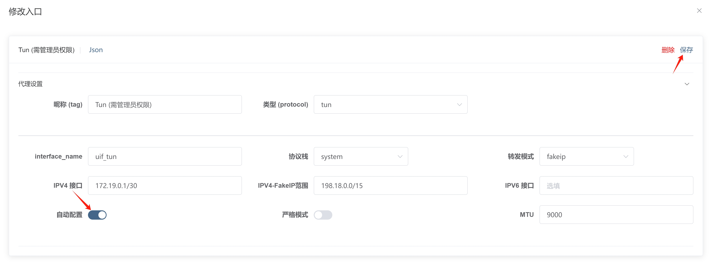

# TUN (透明代理) 方式

该方式侵入式很强，会接管系统所有流量，且开启时需要管理员权限，不建议非程序员使用。

:::tip
目前支持 Windows 和 macOS 自动启动并提权，Linux 请自行使用 Systemd
:::

## 开启/关闭

**重要**

- 首次使用时，请到 [入站页面](https://uiforfreedom.github.io/#/in/my)，选择 `Tun` 点击 `启用`，然后右上角`关闭 UIF`，也就是说必须重启 `uif` 才能生效；

因为 Windows 和 macOS 首次使用时是没有提权，Linux 用户不受限制。

- 非首次使用，直接点击 `启用` 开关即可

:::warning
macOS 使用 Tun 时建议把 interface_name 留空（自动选一个名字），不然的话容易起冲突
:::

## 设置 IP 路由

TUN 会帮你设置一个网卡，需要设置你的操作系统，使所有的 IP 流量都转发到你的网卡。

UIF 会默认帮你设置好 IP 路由；

在 Windows 中使用 `route print`，在 Linux 中使用 `iptable` 即可查看。

如果你不想自动设置好 IP 路由，到 [入站页面](https://uiforfreedom.github.io/#/in/my)；选择 `Tun` 点击 `详情` -> `代理设置` -> `自动配置`。

## 分流模式

| 类型                              | 域名探测（使用 Geosite) | CDN 友好 | 精确分流 | DNS 污染 |
| --------------------------------- | ----------------------- | -------- | -------- | -------- |
| Fake IP                           | √                       | √        | ×        | √        |
| Real IP                           | ×                       | ×        | √        | √        |
| Real IP (With ECS)                | ×                       | √        | √        | √        |
| Real IP (With ECS and Block QUIC) | √                       | √        | √        | √        |

Tun 会接管操作系统的 TCP/UDP 协议栈，正常来说不能也不应该获得套接字（Socks) 的目标地址，但为了能够使用 geosite 进行分流，内核做了很多操作，包括 sniffing 和 FakeIP 等。

- 如果你使用 FakeIP 模式，顾名思义 DNS 解析时会返回**假的 IP**，内核路由系统通过识别假 IP，从而获得 Socks 地址，那么就可以根据域名分流。

- 如果你使用 RealIP 模式，顾名思义 DNS 解析时会返回**真的 IP**，内核路由不会获得 Socks 地址，那么就无法域名分流，只能使用 IP 分流。

总的来说，如果你希望`国内直连，国外代理`分流更加精确，建议使用 RealIP。如果你比较在意 DNS 解析速度，建议使用 FakeIP。

由于 QUIC（h3） 比较难探测，而且性能不高，通常人们会禁用 QUIC，使连接回退到 h2。Fake IP 无法挟持基于加密的 DNS 解析，同时无法当 Tun 重启时，可能会导致临时断网，需等待用户端的软件重新进行 DNS 解析。

## 使用子网

去到 [路由设置](http://ui4freedom.org/#/route/my)，根据自己的实际网络环境，填入不同的 `本地子网`，此时做 DNS 解析时，会把你的大概物理位置发送给 DNS 服务器，DNS 服务器根据实际的情况给你分配最佳的 IP，但前提是 DNS 服务器支持此功能（建议使用 8.8.8.8）。

子网一般配合 `RealIP` 使用，提高分流的精度；但很多情况下，无法正常地嗅探目标地址域名，从而导致路由分流中的域名规则不生效。

目前支持 ECS 的 DNS 提供商比较少，建议使用 `https://8.8.8.8/dns-query`。

## 设置分享订阅的 Tun

因为本地配置和分享配置是两套不同的配置。分享配置会把入站翻译成出站，放在出站里面去，而且分享配置也是必须包含 Tun 的，所以当你想要设置分享的 Tun 时，可以直接去入站修改 `Tun VPN`的配置。
