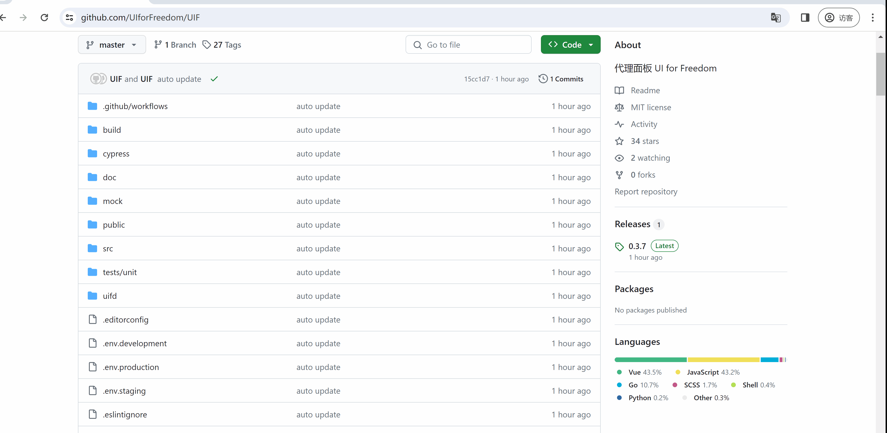
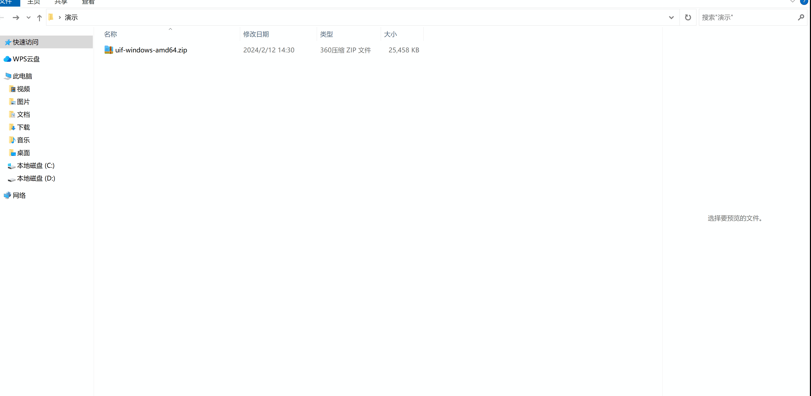
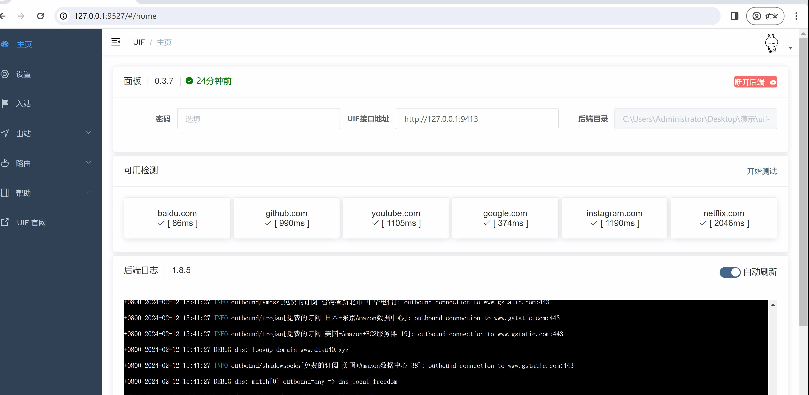

# 快速使用

5 分钟安装并使用，简便，新手友好！

但本文的前提是，假定你已经有可以使用 `出站`（具有代理功能的 VPS，支持 Vmess，Shadowsocks，Trojan 等）

## 第一步，本地安装

UIF 由 `前端网页` + `后端软件` 组成。

只要有网络，都可以查看网页 Web 的内容；但是想要在本地生效，需要安装已编译好的后端。

### 下载

下载地址：

① https://github.com/UIforFreedom/UIF/releases （可能已被屏蔽）

根据你的实际情况选择下载，Windows 代表着你所使用的操作系统，amd64 代表着你所使用的机器的架构；绝大部分人都是 amd64。

这里以 `UIF-windows-amd64.zip` 举例，点击下载；



### 解压

下载完成后，解压到任意位置。会看到如下目录：

```bash
/cores/     # 内核目录
/webs/      # 网页源码
/service/   # 主服务
/version/   # 版本管理
geoip.db    # IP 数据库
geosite.db  # 域名 数据库

uif_key.txt # 首次运行自动生成
UIF         # 主程序
```

## 第二步，运行并连接后端

## Windows、macOS

找到你的解压目录，运行主程序 `UIF`。

这时应该会弹出一个网页；如果你没看到网页（请确保已安装浏览器），可以手动打开任意一个浏览器，在网址处输入： [http://127.0.0.1:9527](http://127.0.0.1:9527)，然后回车访问即可自动连接后端。

:::warning
出于安全的考虑，UIF 默认不暴露 Web 和 API 接口到公网（即默认使用 `127.0.0.1`）。
:::



## Linux

终端用户（例如：Linux）需要手动将 `Web` 和 `API` 两个端口，**同时**暴露到公网，并且**必须**设置密码才可使用。

[如何暴露到公网并设置密码？](./setting)

暴露到公网后，在其他设备使用浏览器访问 Linux 主机。例如说 Linux 主机的 IP 为 `192.168.200.84`，直接打开 `http://192.168.200.84:9527` 即可使用 UIF。

### Linux 常见问题

- 由于 UIF 需要使用到目录 `cores` 里面的内核。运行 UIF 时，请确保具有 `chmod -x` 权限。
- 暴露公网端口时，请同时在 `防火墙` 放行相应端口。

## 第三步，添加出站

第三步的前提是要完成第二步，Web 右上角弹出一个 `已成功连接` 的提示框时，才意味着完成了第二步。

如果你想要代理功能（翻墙、科学上网、VPN），你需要有一台能够访问外网的服务器，俗称 VPS，并且该服务器具有代理的功能。

### 自添加

如果你是自己搭建代理服务器，到 [自添加页面](https://uiforfreedom.github.io/#/out/my)，点击右上角 `添加`，根据你的实际情况添加。

### 订阅

如果你是购买了一些服务（例如说 `机场`等带订阅的服务）；

到 [我的订阅页面](https://uiforfreedom.github.io/#/out/subscribe)，点击 `添加订阅`，`导入方式` 选择 `链接`，填入订阅链接，右上角 `添加`。

### 迁移

如果你已有代理软件的配置（支持 Clash、 Clash-Meta、V2ray、Xray、Sing-Box）；

到 [我的订阅页面](https://uiforfreedom.github.io/#/out/subscribe)，点击 `添加订阅`，`导入方式` 选择 `原始数据`，填入已有配置，右上角 `添加`。


## 最后一步，启动

去到 [入站](https://uiforfreedom.github.io/#/in/my)，点击列表项左侧的 `启用`，UIF 已为你配置好了一些常用的 `入站`，比如说 `HTTP 入站` 和 `Tun VPN`。

如果你是普通用户，平时只是看看 油管，推特，脸书等，建议你使用 `HTTP 入站` 即可。

如果你是码农，平时需要使用到非 HTTP 协议，使用 `Tun VPN` 表现会更好。



---

欢迎使用 UIF！
